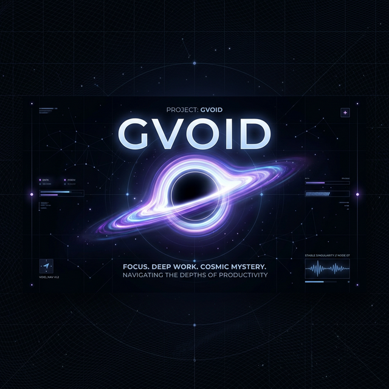

<p align="center">
  
</p>

<h1 align="center">GVOID</h1>

<p align="center">
  <strong>A Premium Pomodoro & Deep Work Station for the Modern Professional.</strong>
</p>

<p align="center">
  
  
  
  
</p>

---

## 🌌 Overview

**GVOID** is more than just a timer; it's a dedicated workspace designed to help you descend into the "Void" of deep focus. By integrating advanced session tracking, immersive soundscapes, and a fully customizable modular interface, GVOID empowers you to reclaim your attention and master your productivity.

## ✨ Core Features

### 🛠️ Modular Workspace
Built on a high-performance grid system, GVOID allows you to drag, resize, and arrange your productivity tools exactly how you like them. Every session is unique to your workflow.

### 📊 Mission Control (Statistics)
Track your progress with precision. Mission Control provides a high-level overview of your focus metrics:
- **Focus Efficiency**: Measure the quality of your sessions.
- **Total Focus Time**: Accumulate your deep work hours.
- **Session Breakdown**: Get granular data on your daily productivity peaks.
- **Game Stats**: Integrated "Void Matter" and progression systems to gamify your focus.

### 🎧 Sonic Depths (Ambient Audio)
Drown out the world with a curated selection of high-fidelity soundscapes:
- **Curated Playlists**: Lo-fi, Nature, Deep Space, and White Noise.
- **Breakcore Integration**: High-energy tracks for those intense coding bursts.
- **Non-Intrusive Controls**: Manage your audio environment without breaking your flow.

### 🎨 Celestial Themes
Choose a visual mood that fits your current task. GVOID features 10+ premium, hand-crafted themes including:
- `Event Horizon` | `Solar Flare` | `Deep Sea Vent` | `Nebula Mist`
- `Retro Terminal` | `Supernova` | `Void Glitch` | `Stardust`
- `Cyber-Punk` | `Frozen Moon`

### 🏗️ Advanced Task Management
Integrated task lists that evolve with your session. Add, complete, and track goals seamlessly within the workstation.

---

## 🚀 Getting Started

### Prerequisites
- **Node.js**: v18.0.0 or higher
- **npm** or **yarn**

### Installation

1. **Clone the repository:**
   ```bash
   git clone https://github.com/SketchyRock/Gvoid.git
   cd Gvoid
   ```

2. **Install dependencies:**
   ```bash
   npm install
   ```

3. **Start the development server:**
   ```bash
   npm run dev
   ```

4. **Launch the Station:**
   Navigate to `http://localhost:5173` in your browser.

---

## 🛠️ Tech Stack

- **Frontend**: [React 19](https://react.dev/) - Modern, concurrent UI rendering.
- **Styling**: [Tailwind CSS](https://tailwindcss.com/) - Utility-first styling for a sleek, responsive design.
- **Build System**: [Vite](https://vitejs.dev/) - Lightning-fast development and build cycles.
- **Layout Engine**: [React Grid Layout](https://github.com/react-grid-layout/react-grid-layout) - Powering the modular, draggable widgets.
- **Audio Engine**: [React Player](https://github.com/cookpete/react-player) - Robust playback for any audio source.

---

## 📄 License

Distributed under the MIT License. See [LICENSE](LICENSE) for more information.

## 🤝 Contributing

Contributions are welcome! If you have ideas for new widgets, themes, or soundscapes, feel free to fork the repo and submit a PR.

1. Fork the Project
2. Create your Feature Branch (`git checkout -b feature/AmazingFeature`)
3. Commit your Changes (`git commit -m 'Add some AmazingFeature'`)
4. Push to the Branch (`git push origin feature/AmazingFeature`)
5. Open a Pull Request

---

<p align="center">
  Developed with ❤️ by <a href="https://github.com/SketchyRock">SketchyRock</a>
</p>
